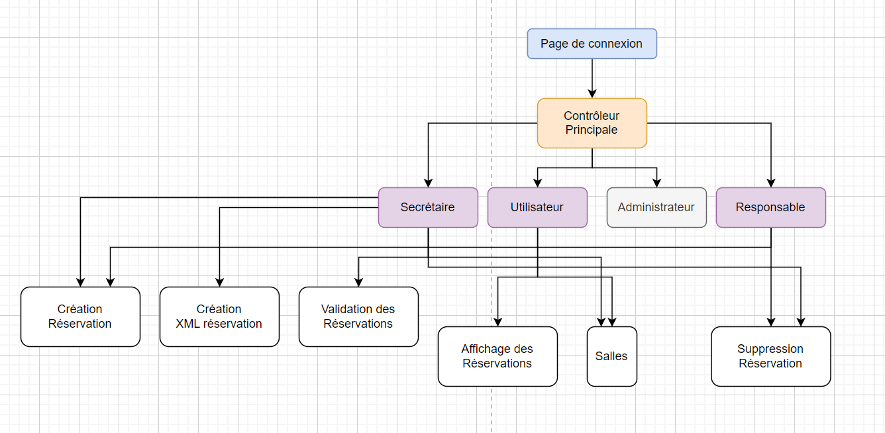
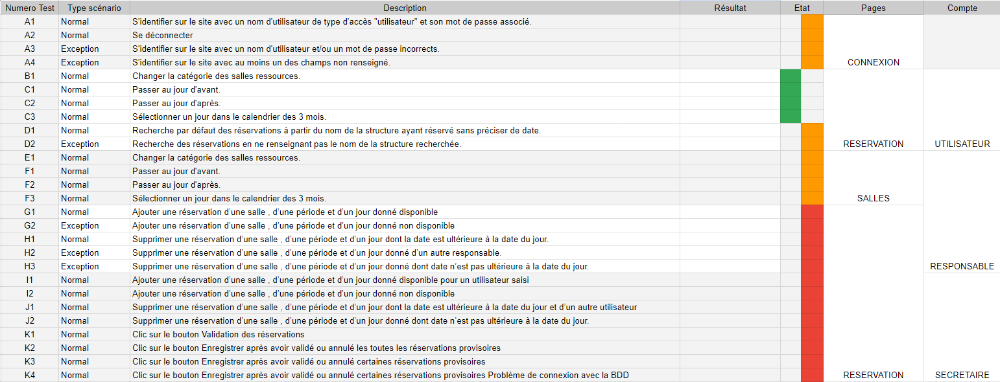

# Mission 2 – Site web de réservation de salles

### Presentation du projet
L'application web de réservations de salles n’est plus satisfaisante, car elle ne respecte pas les critères de sécurité imposés aujourd’hui. On vous demande de refaire celle-ci. Le déploiement de cette nouvelle version doit être précédé d'une validation de l'application.

Ce projet est donc une continuité du projet valres de base qui permet la gestion des reservations des clients M2L. Pour ce faire nous avons mit en place un site internet où les utilisateurs en fonction de leur statut auront des accès variés.

### Outils utilisé
* Hebergement local du site: [WampServer](https://www.wampserver.com/)
* Organisation / Plannification / Cahier des Charges: [Drive](https://drive.google.com/) et [Tuleap Campus](https://tuleap-campus.org/)
* IDE (Environnement de Developpement): [Visual Studio Code](https://code.visualstudio.com/)

__Les grades:__
* **Administrateur** : personne chargée de maintenir à jour les informations relatives aux
utilisateurs et pouvant consulter à tout moment l’état des salles.
* **Secrétariat** : personne chargée de valider les réservations et pouvant réserver une salle et
consulter l’état des salles à tout moment.
* **Responsable** : personne effectuant les réservations des salles (état provisoire) et pouvant
consulter à tout moment l’état des salles.
* **Utilisateur** : personne pouvant consulter à tout moment les réservations des salles.

### Architecture MVC 
Pour la réalisation de ce projet avec mon camarade, nous avons utilisé la méthode MVC qui permet de structurer de la façon la plus conventionnel possible notre projet.

* Model → Contient les script qui permettent la liaison vers la BDD
* View → Permet de gérer tout la partie Front *(Affichage du site web)*
* Controller → Comme son nom l'indique controle / vérifier que les *données* entrées peuvent correctement être exploitées

__source :__
* [MVC en 5min](https://www.youtube.com/watch?v=gs-61l4Z32M&pp=ygUDTVZD)
* [MVC plus détailler](https://www.youtube.com/watch?v=HxhwAc7zzgE&pp=ygUDTVZD)

---
### Repartition du travail (Cahier des Charges)
#### Partie Administration (Tduki) :
* Gérer les accès : ajouter, supprimer, modifier l’accès pour une personne (Administrateur, secrétariat...)
* Gérer la connexion et déconnexion des utilisateurs.
* Consulter les réservations.
* Générer le fichier xml des utilisateurs de début d’année.

#### Partie Réservation (Medhi) :
* Gérer les réservations : ajouter, supprimer une réservation.
* Confirmer ou annuler les réservations. (Passage de l’état « Provisoire » à « Confirmé » ou
« Annulé »)
* Consulter les salles disponibles.
* Générer le fichier xml des réservations validées d’une semaine.
---

### Base de projet
Durant la construction de **Valres2** nous avons put prendre certaine initative tel que :
* Modification de la Base de donnée
* Ajout d'informations sur le tableau Kamban (Tuleap Campus)
* Partage des fichiers sur Drive / Github

### Partie Technique
#### Organisation
Pour réaliser le site web de Valres, j'ai schématisé un plan de liaison de l'enssemble des pages en fonction du rôle de l'utilisateur.


Puis j'ai mit en place un tableau de test qui permet de vérifier que les fonctionnalités du projet soit opérationnelle.


#### Arborescence

```
Valres2
├─ bdd
│  ├─ insert_mdll.sql
│  ├─ mdll.sql
│  └─ remove_mdll.sql
├─ controller
│  ├─ controllerPrincipal.php
│  ├─ creer_reservation.php
│  ├─ login.php
│  ├─ register.php
│  ├─ reservation.php
│  ├─ root.php
│  ├─ salle.php
│  ├─ suppr_reservation.php
│  ├─ valide_reservation.php
│  └─ xml.php
├─ doc
│  ├─ schema_io.png
│  └─ test_validation.png
├─ getRacine.php
├─ index.php
├─ model
│  ├─ bdd.inc.php
│  ├─ categorie_salle.inc.php
│  ├─ etat.inc.php
│  ├─ message_system.inc.php
│  ├─ periode.inc.php
│  ├─ reservation.inc.php
│  ├─ salle.inc.php
│  ├─ structure.inc.php
│  └─ utilisateur.inc.php
├─ README.md
├─ reservations.xml
├─ todo
└─ vue
   ├─ css
   │  ├─ connexion.css
   │  ├─ creer_reservation.css
   │  ├─ reservation.css
   │  ├─ root.css
   │  ├─ salle.css
   │  ├─ valide_reservation.css
   │  └─ variable.css
   ├─ entete.php
   ├─ vueConnexion.php
   ├─ vueCreerCompte.php
   ├─ vueCreerReservation.php
   ├─ vueReservation.php
   ├─ vueSalle.php
   ├─ vueSupprimerReservation.php
   ├─ vueValideReservation.php
   └─ vueXML.php
```
